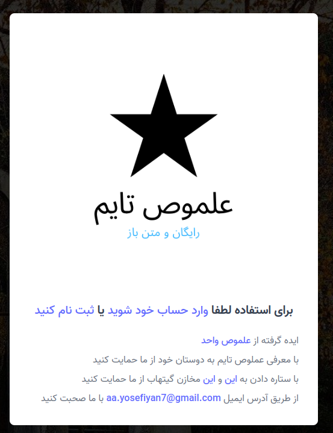
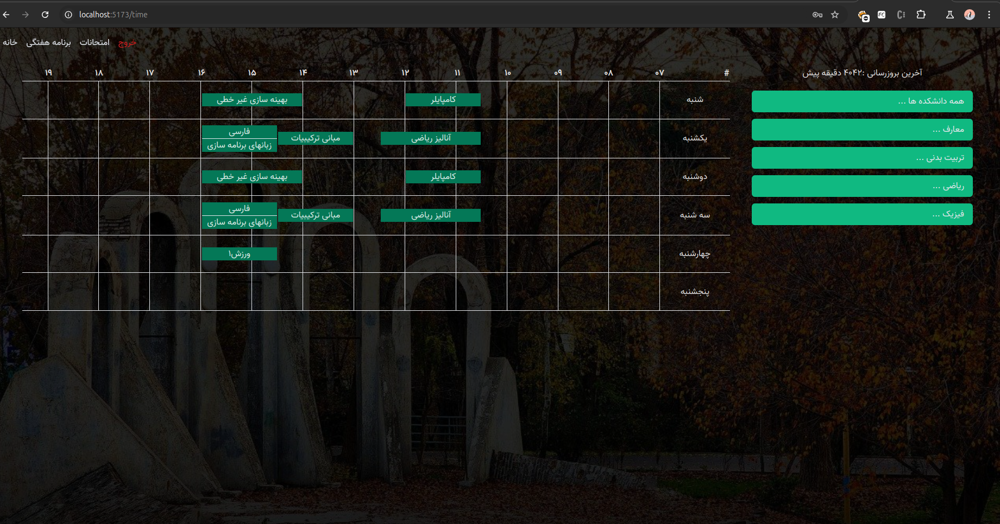
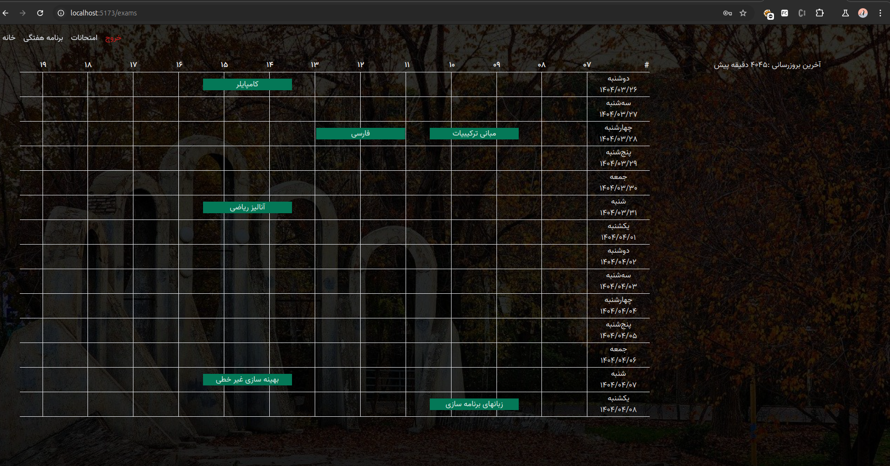
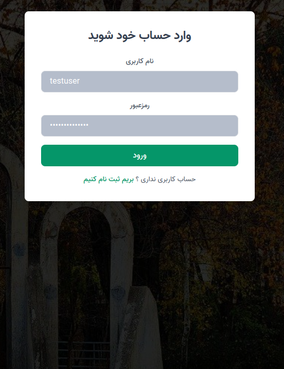
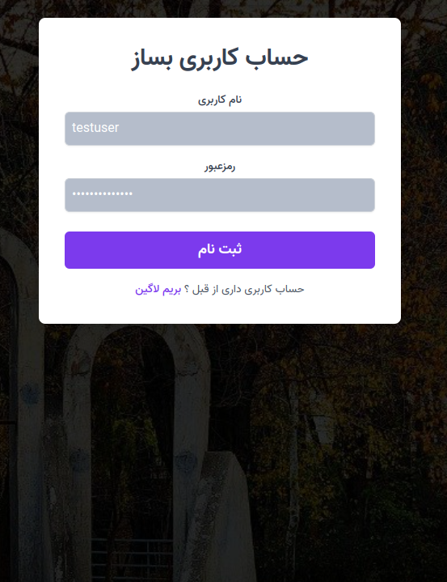

# Elmostime (frontend)
https://elmostime.vercel.app/






## Overview

This project provides a university course timetable application. Users can select their enrolled courses for a term and view their weekly schedule and exam dates in a structured table format. The frontend is built using pure Svelte, while the backend consists of a Flask API that interacts with MongoDB.


Visit https://github.com/MohammadYSF/golestan_scrape  for the backend application

## Features

- View weekly university timetables by selecting a course.
- Display exam dates alongside course schedules.
- Frontend built with pure Svelte and Vite.
- JWT-based authentication .
- Docker Compose for easy deployment.

## Installation

### Prerequisites

Ensure you have the following installed:

- Docker & Docker Compose (for Docker setup)
- Node.js (for manual setup)

### Setup

#### Using Docker

1. Clone the repository:
   ```sh
   git clone https://github.com/your-repo.git
   cd your-repo
   ```
2. Create a `.env` file in the root directory and define your environment variables:
   ```ini
   VITE_API_URL=http://backend:5000
   ```
3. Start the services using Docker Compose:
   ```sh
   docker-compose up --build
   ```
4. The frontend will be available at `http://localhost:5173`.

#### Without Docker

1. Clone the repository:
   ```sh
   git clone https://github.com/your-repo.git
   cd your-repo
   ```
2. Install dependencies:
   ```sh
   npm install
   ```
3. Set environment variables manually:
   ```sh
   export VITE_API_URL="http://localhost:5000"
   ```
4. Start the development server:
   ```sh
   npm run dev
   ```
5. Navigate to `http://localhost:5173` to access the frontend.

## API Integration

The frontend communicates with the Flask backend API. Ensure the backend is running before using the application.

## Contributing

Feel free to contribute by submitting issues and pull requests.

## License

This project is licensed under the MIT License.

## Author
Mohammad Yousefiyan

